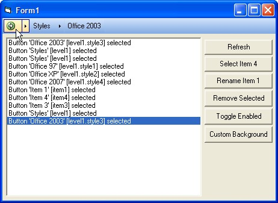



## MenuNavigator

### Description

Windows Vista/WMP11 menu navigation bar with 4 pre MS Office styles. A simple usercontrol that implements this "new" UI experience. Very simple to use.
 
### More Info
 

             |
---                |---
**Submitted On**   |2006-06-14 18:39:34
**By**             |[Poorlyte](https://github.com/Planet-Source-Code/PSCIndex/blob/master/ByAuthor/poorlyte.md)
**Level**          |Intermediate
**User Rating**    |5.0 (55 globes from 11 users)
**Compatibility**  |VB 6\.0
**Category**       |[Custom Controls/ Forms/  Menus](https://github.com/Planet-Source-Code/PSCIndex/blob/master/ByCategory/custom-controls-forms-menus__1-4.md)
**World**          |[Visual Basic](https://github.com/Planet-Source-Code/PSCIndex/blob/master/ByWorld/visual-basic.md)
**Archive File**   |[MenuNaviga2001786192006\.zip](https://github.com/Planet-Source-Code/poorlyte-menunavigator__1-65711/archive/master.zip)

